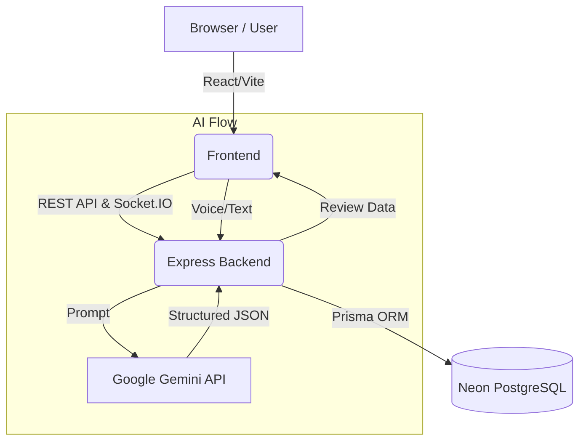

# Bharat Bazaar

Bharat Bazaar is an AI-powered digital growth platform designed to help local and rural artisans build a professional digital presence by connecting them with skilled college students who can assist in growing their businesses.

"Local craft. Limitless possibilities."

## What is Bharat Bazaar?
Bharat Bazaar is a collaborative marketplace that focuses on discovery, product showcase, and skill exchange. Instead of a traditional e-commerce storefront, it is a bridge between creators (Artisans) and digital facilitators (Growth Managers / Students). The platform allows artisans to easily list their products using AI and voice input, and request digital marketing or technical assistance from students to reach a broader audience.

## The Problem
Many local and rural artisans possess incredible craftsmanship but struggle with:
- Limited digital presence and reach.
- Difficulty in creating professional product listings, descriptions, and photography.
- Lack of digital marketing and technical skills needed in today's digital economy.
- Challenges in connecting with people who have these necessary digital skills.

## The Solution
Bharat Bazaar solves this by providing a unified workflow where artisans can easily digitize their inventory using intuitive voice-to-text AI, and collaborate with students in a dedicated workspace. The platform empowers artisans to focus on their craft while students help build their digital presence in exchange for real-world experience and reputation.

## How It Works
The platform implements a focused collaboration workflow:
1. Artisan signs up and creates an account.
2. Artisan creates a product (using voice input or text).
3. Backend AI (Gemini) generates structured product information.
4. Artisan reviews and edits the product details.
5. Artisan uploads a product image and publishes the product.
6. Artisan creates a Growth Manager request for digital assistance.
7. Students browse available requests and submit applications.
8. Artisan reviews applications and selects a student.
9. A project workspace is automatically created.
10. Artisan and student communicate via real-time chat in the project workspace.
11. Upon project completion, the artisan rates the student.
12. The student's reputation and completed project count are updated.

*(Note: The marketplace is focused on discovery and collaboration. It does not currently include online checkout, payments, or order logistics.)*

## Who Uses Bharat Bazaar?

### Artisans
Local business owners and creators who can:
- Create accounts and manage their profile.
- Generate product listings using voice/text and AI.
- Upload images and publish products to the marketplace.
- Request help from students (Growth Managers).
- Select students, manage projects, and communicate in real-time chat.
- Rate students upon project completion.

### Growth Managers / Students
Students looking to build real-world experience who can:
- Create an intern account.
- Browse open Growth Manager requests from artisans.
- Apply to requests that match their skills.
- Work within a project workspace and chat with artisans.
- Complete projects to build their platform reputation.

### Admin
*Platform administration roles exist in the database and middleware, but a dedicated admin management dashboard UI and administrative routes are **not currently implemented**.*

## Core Features

### Authentication
- User registration and login.
- JWT-based authentication.
- Protected API routes and role-based access control.

### AI Product Creation
- Text description processing.
- Gemini `gemini-3.8-flash` generation.
- Structured JSON output mapping to product fields.
- Editable generated data prior to publishing.

### Voice-Based Product Creation
- Browser-based Speech Recognition (`webkitSpeechRecognition`).
- Hindi/English input support (dependent on browser capabilities).
- Voice input converted to editable text for AI processing.

### Product Marketplace
- Public product listings and details pages.
- Artisan-owned product inventory.
- Product images.

### Growth Manager Marketplace
- Dedicated request board for artisans to seek help.
- Application workflow for students.
- Selection and approval process.

### Project Workflow
- Automatic project workspace creation upon applicant selection.
- Project status tracking (e.g., In Progress, Completed).
- Secure project membership protection.

### Real-Time Collaboration
- Socket.IO integration for live messaging.
- Secure project-specific chat rooms.
- Message persistence in the PostgreSQL database.

### Ratings & Reputation
- Post-project rating system.
- Student reputation tracking (aggregate scores and completed project counts).

## System Architecture



Authentication requests flow from the frontend via JWTs to protected backend routes where role-based authorization and ownership checks are rigidly enforced.

## Technology Stack

**Frontend:**
- React
- Vite
- Tailwind CSS
- React Router
- Axios
- Framer Motion
- Lucide React
- Socket.IO Client

**Backend:**
- Node.js
- Express
- Prisma
- PostgreSQL
- JWT & bcrypt
- Multer & Sharp
- Socket.IO
- Google Gemini API (`@google/genai`)

**Database & Deployment:**
- Neon PostgreSQL
- Vercel (Frontend Hosting)
- Render (Backend Hosting)
- GitHub (Source Control)

## Project Structure

```text
Bharat-Bazaar/
├── client/
│   ├── public/
│   ├── src/
│   │   ├── components/
│   │   ├── pages/
│   │   ├── services/
│   │   ├── context/
│   │   └── App.jsx
│   ├── package.json
│   └── vite.config.js
├── server/
│   ├── prisma/
│   │   └── schema.prisma
│   ├── src/
│   │   ├── controllers/
│   │   ├── middleware/
│   │   ├── routes/
│   │   └── index.js
│   ├── uploads/
│   ├── package.json
│   ├── .env.example
│   └── render.yaml
├── MVP_STATUS.md
├── PRODUCTION_SMOKE_TEST_REPORT.md
└── README.md
```

## User Roles & Permissions

| Role | Purpose | Main Capabilities |
|---|---|---|
| **ARTISAN** | Local business owner/creator | Create products, request Growth Managers, review applications, manage projects, use chat, rate students. |
| **INTERN** | Student Growth Manager | Browse requests, apply for projects, chat in project workspaces, earn reputation. |
| **ADMIN** | Platform administration | Role structure exists, but dedicated admin routes/UI are currently unimplemented. |

## API Overview

### Authentication
- `POST /api/auth/register` - Register a new user (Public)
- `POST /api/auth/login` - Authenticate and receive a JWT (Public)
- `GET /api/auth/me` - Get current user profile (Authenticated)

### Products
- `GET /api/products` - List marketplace products (Public)
- `GET /api/products/:id` - Get product details (Public)
- `POST /api/products/generate` - Generate product data via Gemini AI (Auth: ARTISAN)
- `POST /api/products` - Publish a new product (Auth: ARTISAN)

### Growth Manager Requests & Applications
- `GET /api/requests` - List open Growth Manager requests (Public)
- `POST /api/requests` - Create a new request (Auth: ARTISAN)
- `POST /api/applications` - Apply to a request (Auth: INTERN)
- `POST /api/applications/:id/status` - Accept/reject application (Auth: ARTISAN)

### Projects & Chat
- `GET /api/projects/:id` - Get project workspace details (Auth: Project Members)
- `POST /api/projects/:id/complete` - Mark project as complete (Auth: ARTISAN)
- `GET /api/projects/:id/messages` - Get chat history (Auth: Project Members)
- `POST /api/projects/:id/messages` - Send a message (Auth: Project Members)

### Ratings
- `POST /api/ratings` - Rate a student after project completion (Auth: ARTISAN)

## Local Development

1. **Clone the repository:**
   ```bash
   git clone https://github.com/ShivayAgarwal08/BHARAT-BHAZAAR-1.git
   cd BHARAT-BHAZAAR-1
   ```

2. **Install dependencies:**
   ```bash
   cd server && npm install
   cd ../client && npm install
   ```

3. **Configure Environment Variables:**
   Navigate to `server/` and create a `.env` file based on `.env.example`:
   ```bash
   cp server/.env.example server/.env
   ```
   *(Never commit the `.env` file to version control).*

4. **Configure Database (Neon PostgreSQL):**
   Ensure your Neon PostgreSQL instance is running and update `DATABASE_URL` in `server/.env`.

5. **Run Prisma Setup:**
   ```bash
   cd server
   npx prisma generate
   npx prisma db push
   ```

6. **Start the Backend:**
   ```bash
   cd server
   npm run dev
   ```

7. **Start the Frontend:**
   ```bash
   cd client
   npm run dev
   ```

## Environment Variables
The following environment variables are required in `server/.env`:
- `DATABASE_URL` - Connection string for the PostgreSQL database (Neon).
- `JWT_SECRET` - Secret key used for signing authentication tokens.
- `GEMINI_API_KEY` - API key for the Google Gemini AI.
- `AI_MODEL` - Specific Gemini model version (default: `gemini-3.8-flash`).
- `CLIENT_URL` - Allowed CORS origin for the frontend application.
- `PORT` - The port the Express server runs on.

## Deployment

Bharat Bazaar is deployed using a decoupled architecture:

- **Frontend:** Hosted on **Vercel** (`https://bharat-bhazaar-1.vercel.app`)
- **Backend:** Hosted on **Render** (`https://bharat-bazaar-api.onrender.com`)
- **Database:** Hosted on **Neon** (PostgreSQL)

Important deployment configuration:
- The frontend `VITE_API_URL` environment variable points to the Render backend URL.
- The backend `CLIENT_URL` environment variable points to the Vercel frontend URL for CORS policy enforcement.
- Localhost URLs are strictly excluded from the production build.

## Testing & QA
A complete production smoke test has been executed on the stable MVP. Core workflows including Authentication, Authorization, AI Generation, Marketplace browsing, Project collaboration, Chat, and Ratings have all passed end-to-end testing in the live production environment. For more information, see `PRODUCTION_SMOKE_TEST_REPORT.md` and `MVP_STATUS.md`.

## Known Limitations
1. **Admin Management:** Dedicated admin management UI and routes are not implemented.
2. **Automated Voice Testing:** Automated microphone testing is limited because browser microphone permissions require real user interactions.
3. **Render Upload Persistence:** Uploaded product images are currently stored in the server's local file system (`/uploads`). Because Render uses an ephemeral file system on its free tier, uploads will not persist across server restarts. This is a known limitation.
4. **E-commerce Features:** There is no full payment gateway, shopping cart, checkout, or order logistics system in the current MVP.

## Future Roadmap
- Integration with persistent cloud object storage (e.g., AWS S3, Cloudinary) for reliable image hosting.
- Development of a complete Admin dashboard.
- Real-time notifications and advanced analytics.
- Improved search, filtering, and categorization.
- Multilingual voice improvements and AI marketing assistant features.
- Potential integration with open networks (ONDC) or logistics providers.
- Payment gateway integration for direct marketplace transactions.

## Project Vision
Bharat Bazaar aims to make digital growth accessible to local artisans while creating practical opportunities for students to apply their skills. 

*"Local craft. Limitless possibilities."*

## License
*This project is unlicensed / proprietary unless otherwise specified.*
